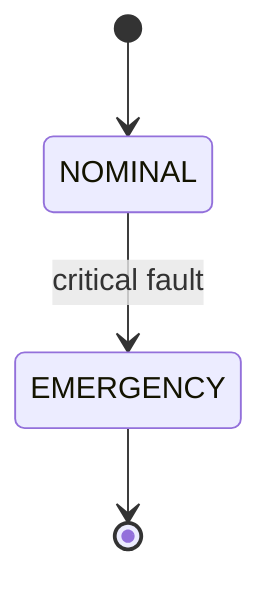

# mdToPDF

> This project is open-sourced on [github](https://github.com/jianyuewushuang/mdToPDF?tab=readme-ov-file) and [gitlink](https://www.gitlink.org.cn/jianyuewushuang/mdToPDF) (China-network friendly).

A Chinese Markdown-to-PDF project based on **Pandoc + LuaLaTeX**.

This project is derived from and heavily adapted for Chinese from [Eisvogel](https://github.com/Wandmalfarbe/pandoc-latex-template).

It supports a graded six-level heading scale, Chinese fake-bold / fake-italic, colorful emoji and special symbols, GitHub-style admonitions, code highlighting, tables and math formulas — ideal for turning course notes, lab reports and documents into polished, good-looking PDFs.

## Preview


## Features

- **Graded six-level heading scale**: `#` to `######` step down in size, with a clear hierarchy.
- **Chinese bold / italic**: `AutoFakeBold` / `AutoFakeSlant` allow synthesizing bold and italic even for fonts that lack them.
- **Colorful emoji and special symbols**: uses `lualatex` + `mainfontfallback` to render Unicode characters and colorful emojis.
- **GitHub-style admonitions**: the `alerts.lua` filter renders five colored callout blocks — `note / tip / important / warning / caution`.
- **Mermaid diagrams**: the `diagram.lua` filter calls mermaid-cli to render ` ```mermaid ` code blocks into vector images embedded in the PDF.
- **Code highlighting, tables, math formulas**: native Pandoc support, with the `idiomatic` syntax-highlighting style.
- **Title page / TOC / colored links**: controlled via YAML Front Matter switches.

## Directory Structure

```
mdToPDF/
├── src/                    # Holds the Markdown source files
│   └── example.md          # Example Markdown file
├── build/                  # Build output directory; PDFs are auto-generated by build.ps1
├── preview/                # Sample build output and its preview images
├── resources/              # Templates and resources
│   ├── latex/
│   │   ├── eisvogel.latex  # LaTeX template
│   │   └── eisvogel.beamer # beamer template
│   ├── alerts.lua          # GitHub-style admonition Lua filter
│   ├── diagram.lua         # Lua filter for Mermaid and other diagrams
│   └── background.pdf      # Title-page / page background image
├── package.json            # Node dependency manifest (local mermaid-cli)
├── build.ps1               # Windows build script
└── LICENSE.md              # PolyForm Noncommercial License 1.0.0
```

## Requirements

| Component | Version / Notes |
| --- | --- |
| [Pandoc](https://pandoc.org/installing.html) | refer to [one of my blog post](https://blog.jianyuewushuang.top/2026/05/09/pandoc%E6%8A%80%E6%9C%AF%E6%96%87%E6%A1%A3/) for the installation |
| [TeX Live](https://www.tug.org/texlive/) | refer to [my another blog post](https://blog.jianyuewushuang.top/2026/03/26/LaTex%E6%8A%80%E6%9C%AF%E6%96%87%E6%A1%A3/) for the installation |
| [Node.js](https://nodejs.org/) (with npm) | only required for rendering Mermaid diagrams. Run `npm install` in the project root to locally install `@mermaid-js/mermaid-cli` (its Puppeteer dependency automatically downloads Chromium on first run) |
| Fonts | `SimSun`, `Source Sans 3`, `Noto Color Emoji`, `FreeSans`, `DejaVu Sans` |

Font notes: `SimSun` is used for Chinese body text; `Source Sans 3` is the Latin main font; `Noto Color Emoji / FreeSans / DejaVu Sans` form the emoji and special-symbol fallback chain.

## Usage

### One-shot build

Put your Markdown files into `src/`, then run the build script:

```powershell
.\build.ps1
```

The script iterates over every `*.md` in `src/` and produces a matching `build/<name>.pdf` for each.

Build script parameters:

- Input format: `markdown+alerts`
- Template: `resources/latex/eisvogel.latex`
- Engine: `lualatex`
- Filters: `resources/alerts.lua` (admonitions) and `resources/diagram.lua` (Mermaid diagrams)
- Syntax highlighting: `idiomatic`
- Chinese main font: `SimSun`; Latin main font: `Source Sans 3`
- emoji / symbol fallback chain: `Noto Color Emoji` → `FreeSans` → `DejaVu Sans`

### Single-file build

```powershell
pandoc .\src\example.md -o .\build\example.pdf `
  --from markdown+alerts `
  --template ".\resources\latex\eisvogel.latex" `
  --syntax-highlighting idiomatic `
  --pdf-engine "lualatex" `
  -V CJKmainfont="SimSun" `
  -V mainfont="Source Sans 3" `
  -V mainfontfallback="Noto Color Emoji:mode=harf" `
  -V mainfontfallback="FreeSans:mode=harf" `
  -V mainfontfallback="DejaVu Sans:mode=harf" `
  --lua-filter ".\resources\alerts.lua" `
  --lua-filter ".\resources\diagram.lua"
```

> [!NOTE]
> If your document contains Mermaid diagrams, the single-file command needs the filter to find mermaid-cli first:
> `$env:MERMAID_BIN = ".\node_modules\.bin\mmdc.cmd"` (no manual setup is needed when running `build.ps1`, which already sets it).

## Writing Markdown

### Front Matter

Set the title, author, table of contents, title page, etc. with a YAML block at the top of your `.md` file:

```markdown
---
title: "标题"
author: [你的名字]
date: "2026-09-12"
subject: "Markdown"
keywords: [关键词, markdown]
subtitle: "副标题"
titlepage: true            # Enable the cover page
titlepage-rule-color: "00727c"
titlepage-background: "<absolute path>"   # Title-page background
page-background: "<absolute path>"        # Body-page background
colorlinks: true          # Color hyperlinks
block-headings: true      # Headings occupy their own line
toc: true                 # Table of contents
toc-own-page: true        # TOC on its own page
---
```

> [!NOTE]
> During testing we found that using an absolute path for the background prevents a successful build. For any other questions, feel free to discuss them in the Issues section.

### GitHub-style admonitions

Use the GitHub-style `> [!TYPE]` blockquote syntax; `alerts.lua` renders it as a colored block:

```markdown
> [!NOTE]
> Explanation
```

> [!NOTE]
> Explanation

```markdown
> [!TIP]
> Tip
```

> [!TIP]
> Tip

```markdown
> [!IMPORTANT]
> Important
```

> [!IMPORTANT]
> Important

```markdown
> [!WARNING]
> Warning
```

> [!WARNING]
> Warning

```markdown
> [!CAUTION]
> Danger
```

> [!CAUTION]
> Danger

### Mermaid diagrams

Use a code block with the `mermaid` language tag; the `diagram.lua` filter calls
[mermaid-cli](https://github.com/mermaid-js/mermaid-cli) to render the diagram as a vector PDF embedded in the document.
Flowcharts, sequence diagrams, state diagrams, Gantt charts and every other
[diagram type supported by Mermaid](https://mermaid.js.org/syntax/flowchart.html) work:

````markdown

````

**Install the dependency before first use** (Node.js / npm required):

```powershell
npm install
```

The dependency is installed locally inside the project (`node_modules/`), nothing is written to the global environment.
mermaid-cli depends on Puppeteer, which automatically downloads a Chromium build into the user cache directory on its first run.

## Customization

- **Change the template**: edit `resources/latex/eisvogel.latex` (heading sizes, fonts, colors, headers/footers, etc.).
- **Change GitHub-style admonition styles**: edit `resources/alerts.lua` (colors, borders, title text).
- **Change diagram rendering**: edit `resources/diagram.lua`; besides mermaid it also ships with plantuml, graphviz, tikz and d2 engines — install the corresponding executable and use a code block with the matching language tag.
- **Change the build flow**: edit `build.ps1`.
- **Reference upstream**: for other questions you can also refer to the upstream project [Eisvogel](https://github.com/Wandmalfarbe/pandoc-latex-template).

## LICENSE

This project is released under the [PolyForm Noncommercial License 1.0.0](LICENSE.md).

> Required Notice: Copyright 2026 jianyuewushuang <jianyuewushuang@163.com>

Noncommercial use is free to use, modify and distribute; for commercial use, please contact the author.
