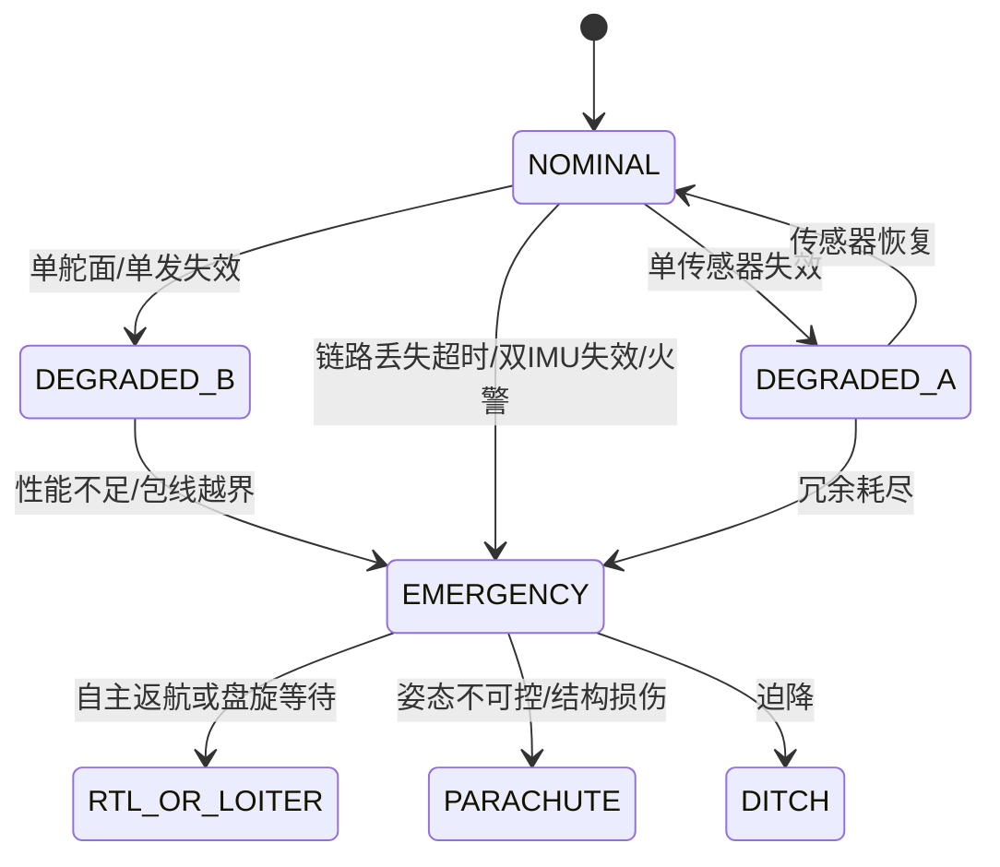

## 二级标题

### 三级标题

#### 四级标题

##### 五级标题

###### 六级标题

正文

**加粗**

*斜体*

***加粗斜体***

- 无序列表
- 无序列表

1. 有序列表
2. 有序列表

> [!CAUTION]
> 警告

```python
# Python代码块
print("Hello, World!")
```

| 项目 | 占比 |
| --- | --- |
| 期末（闭卷） | 60% |
| 平时成绩 | 40% |
| 每堂课笔记作业 | 10% |
| 期中检测 + 平时作业 | 30% |

$$P(\text{甲胜}) = \frac12 + \frac14 = \frac34,\quad P(\text{乙胜}) = \frac14$$

(´▽`ʃ♡ƪ)ᓚᘏᗢ😋✊😊❤✓




